# h3 Cyber lab

Homework 3 for Haaga-Helia’s Cyber Security course (Karvinen 2025).

## x) Read and summarize

The following is a summary of Karvinen (2020) _Command Line Basics Revisited_:

* **Basics:** Command line is fast, powerful, automatable. `$` = prompt, `#` = comment.
* **Navigation:** `pwd` (where am I), `ls` (list files), `cd` (move), `less` (view text), `|` (pipe output).
* **Files:** `nano` (edit), `mkdir` (create folder), `mv` (move/rename), `cp -r` (copy), `rm / rmdir` (delete permanently).
* **Remote:** `ssh user@server` (connect), `scp -r folder user@server:dir/` (copy remotely), `exit` (quit).
* **Help:** `man command`, `command --help`.
* **History:** Tab = autocomplete, arrows = navigate, `history`, Ctrl-R = search.
* **Key Directories:** `/` root, `/home/` users, `/etc/` configs, `/media/` removable, `/var/log/` logs.
* **Admin:** Use `sudo` for privileged tasks only.
* **Packages:** `sudo apt-get update`, `apt-cache search`, `sudo apt-get install`, `sudo apt-get purge`.

Here’s an overview of Karvinen (2022) _Cracking Passwords with Hashcat_:

* Systems store password hashes, not plain text.
* Hashing is one-way; passwords are cracked by guessing words from a dictionary.
* Use tools **hashid** (to detect hash type) and **hashcat** (to crack it).
* Install with `sudo apt-get -y install hashid hashcat wget`.
* Use the **RockYou** wordlist (~14M words) for testing.
* Example: `hashcat -m 0 '6b1628b016dff46e6fa35684be6acc96' rockyou.txt -o solved`.
* Result shows cracked password: `summer`.
* “Status: Cracked” = success, “Status: Exhausted” = no match.

## a) Reserve your presentation title in Moodle

I have already given my presentation.

## b) Linux

The Debian Trixie 13 (64-bit) installation on a VirtualBox VM was completed successfully.

### Step 1: Downloading the Debian ISO

I visited the official Debian website at [https://debian.org](https://debian.org). From the downloads page, I navigated to the section labeled **“Try Debian live before installing”**. I selected the **Live Xfce** and downloaded the `.iso` file.

### Step 2: Creating the Virtual Machine

I opened **Oracle VirtualBox Manager** and clicked on the **“New”** button to create a new virtual machine. I named the machine `LinuxCyberSec`, set the type to **Linux**, and selected the version as **Debian 13 Trixie (64-bit)**. I disabled the “Unattended installation” option to perform a manual installation.


### Step 3: Assigning Resources

I allocated **4096 MB** (4 GB) of RAM to the virtual machine. For CPUs, I chose to assign **8 virtual CPUs**, exceeding the minimum recommendation to ensure smoother performance during installation and usage.

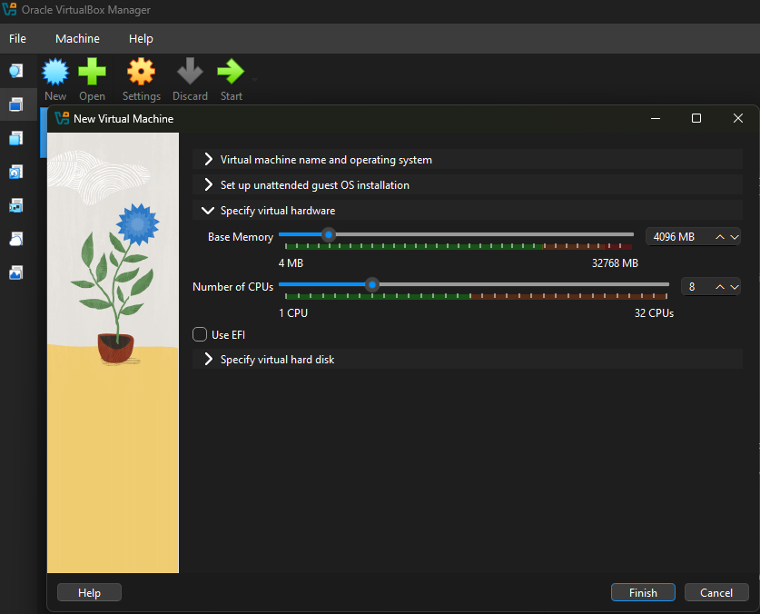

### Step 4: Creating the Virtual Hard Disk

I created a new virtual hard disk with a size of **40 GB**. I left all other settings as default, including the disk type and allocation method.

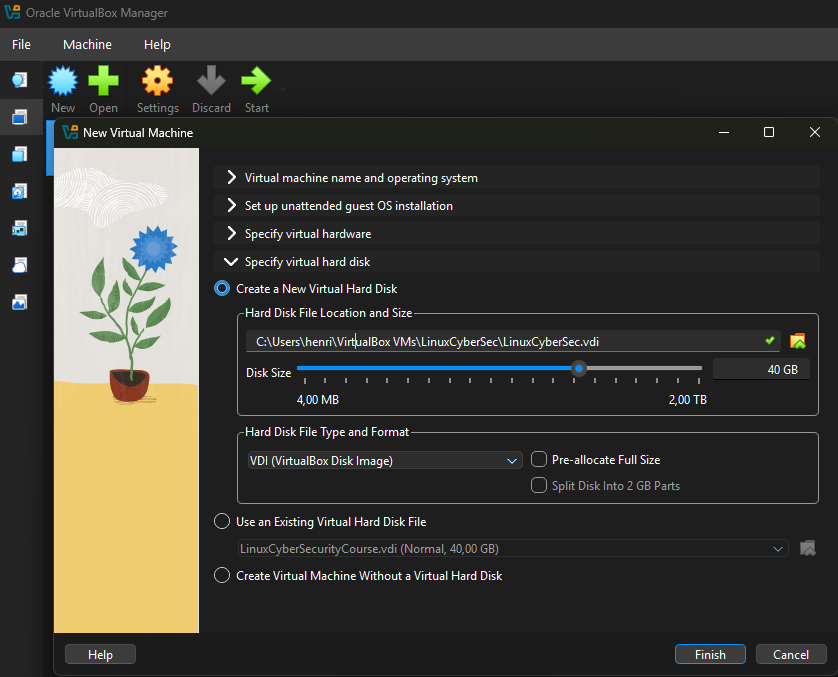

### Step 5: Starting the Virtual Machine

After finalizing the configuration, I clicked **“Finish”** and returned to the VirtualBox Manager. I selected the `LinuxCyberSec` VM and clicked **“Start”** to boot it using the Debian ISO image.


### Step 6: Booting Into the Live Environment

Once the VM started, I was presented with the Debian boot menu. I selected **“Live system (amd64)”** as the boot option and pressed Enter. This launched the Debian live desktop environment.

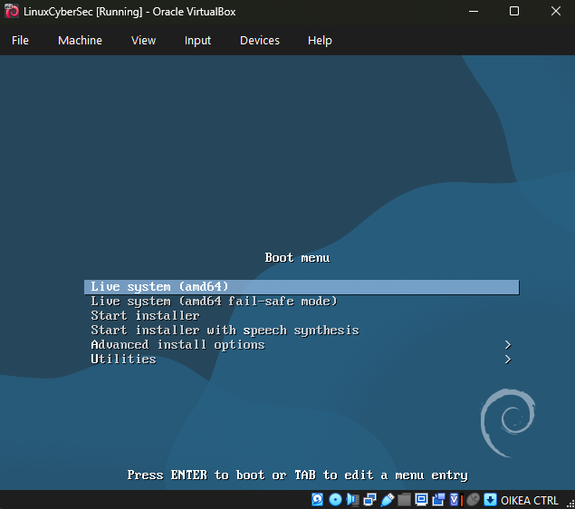

### Step 7: Launching the Installer

From the live desktop, I clicked on the **“Install Debian”** icon to launch the graphical installer. I chose **American English** as the installation language.

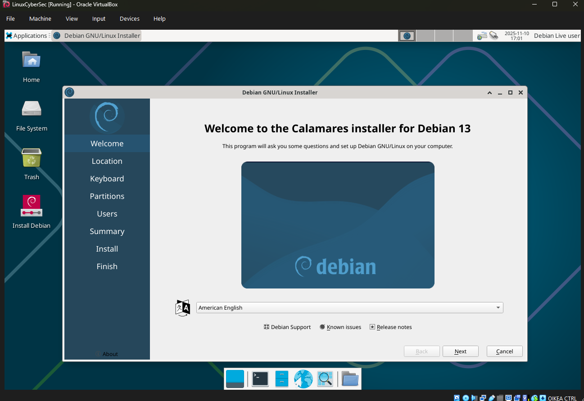

### Step 8: Selecting Region and Timezone

Then I selected **Helsinki** on the world map to set my region and timezone appropriately.

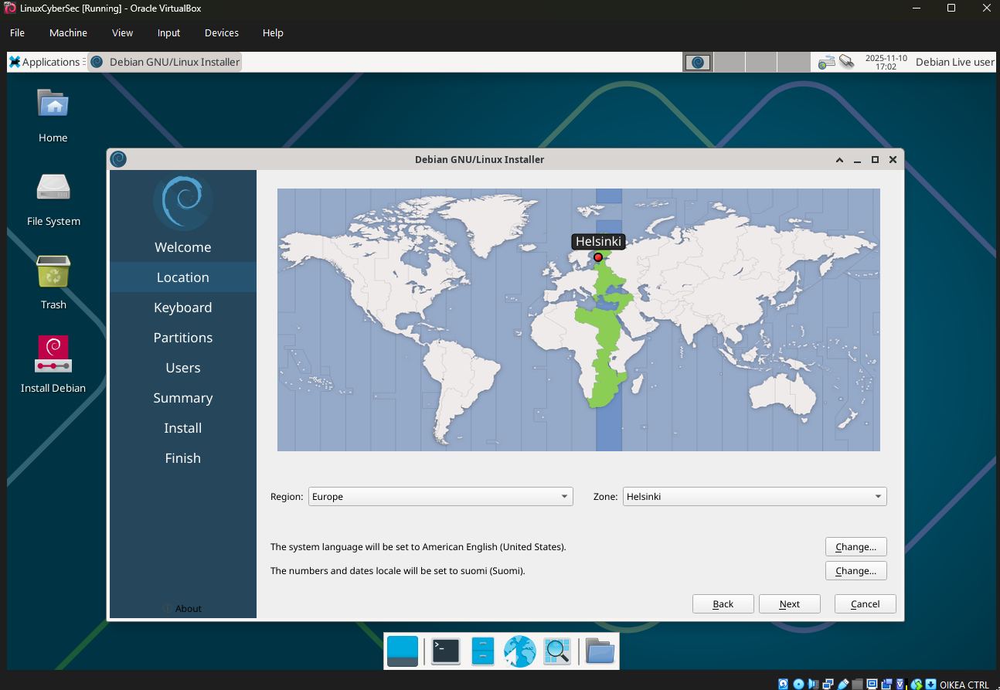

### Step 9: Setting the Keyboard Layout

I selected the **Generic 105-key PC** keyboard model and set the layout to **Finnish**. I confirmed that all special characters worked correctly.


### Step 10: Choosing the Installation Disk

The installer displayed the available disks. I selected the **VBOX hard disk (40 GB)** and verified that it was indeed the virtual drive. I then chose the **“Erase disk”** option to prepare it for installation.

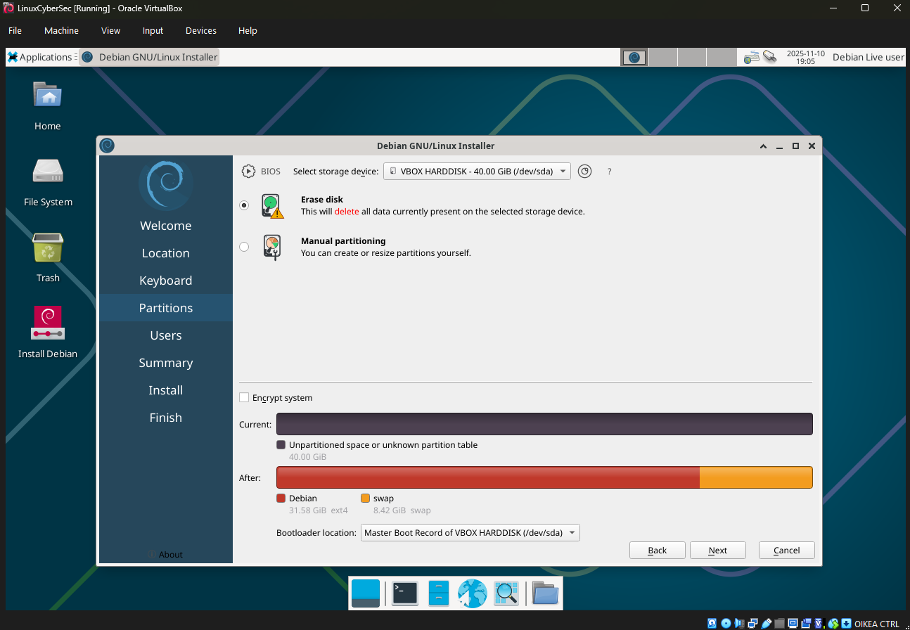

### Step 11: Configuring User and Hostname

I entered my full name as `Henri Pero`. I set the username to `henri` and the computer’s hostname to `cybersec`. I then created a secure password for the user account.

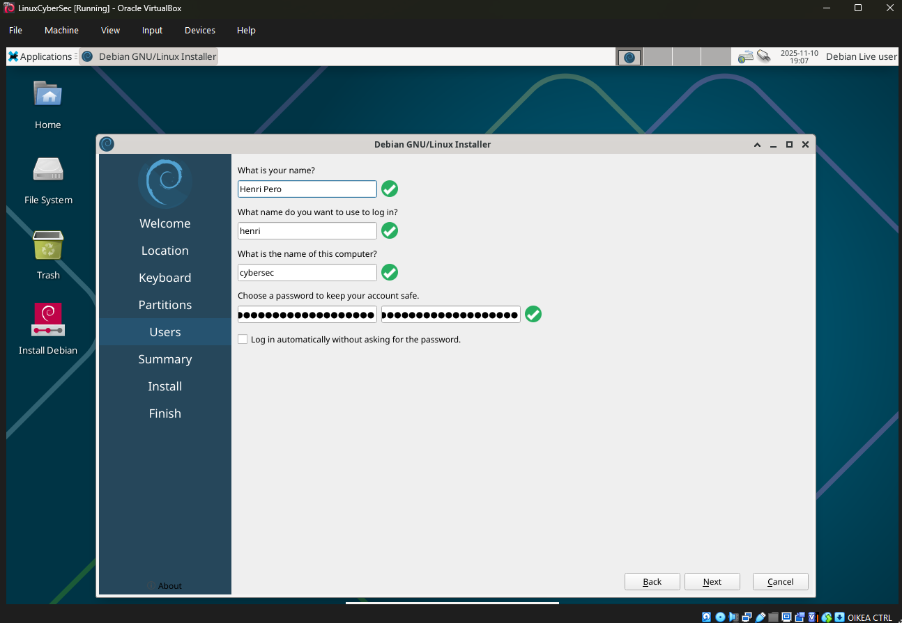

### Step 12: Reviewing the Installation Summary

I reviewed the summary screen, which confirmed all previous selections: language, region, keyboard, and partition settings. After verifying that everything was correct, I clicked **“Install”** to begin the installation.

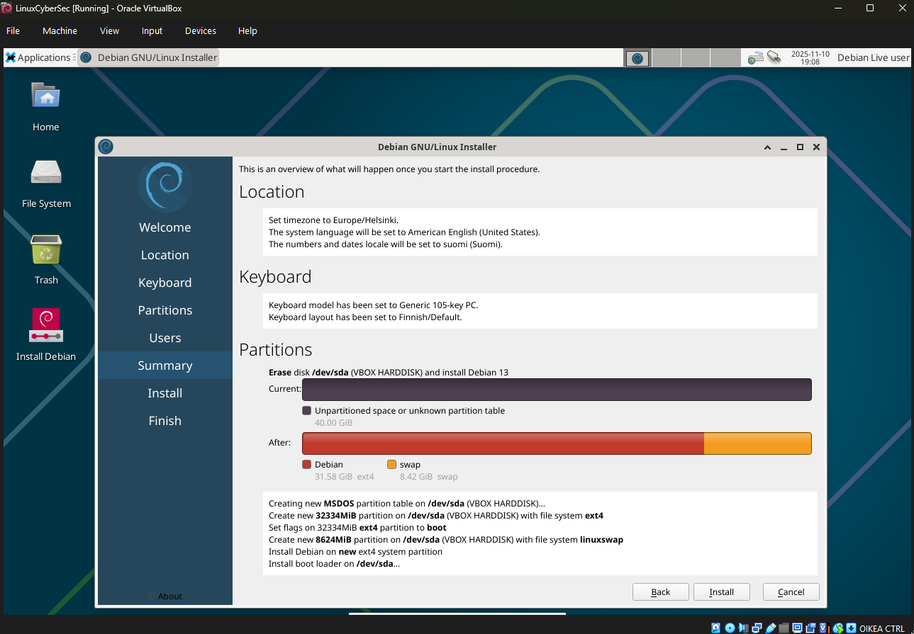

### Step 13: Installing the System

The system began copying files and filling up the filesystem. I observed that the progress bar updated as components were installed. The computer’s fans became more active, indicating ongoing installation tasks.

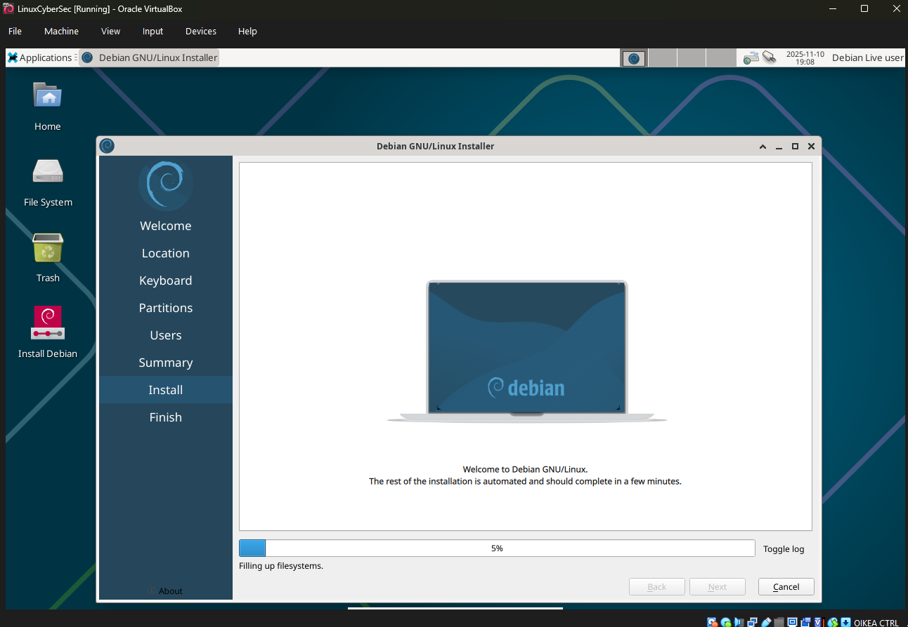

### Step 14: Completing the Installation

After the installation finished, I was given the option to **restart** the system or continue using the live session. I selected the **restart** option to boot into the newly installed Debian system.

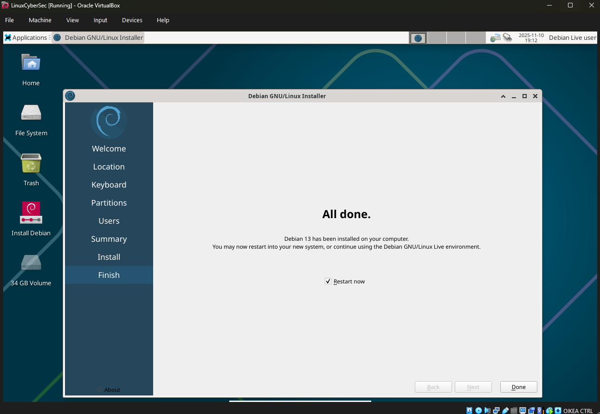

### Step 15: Logging In

The system rebooted and displayed the Debian login screen. I entered the username `henri` and the password I created earlier. Upon successful login, I reached the Debian 13 (Trixie) desktop environment.

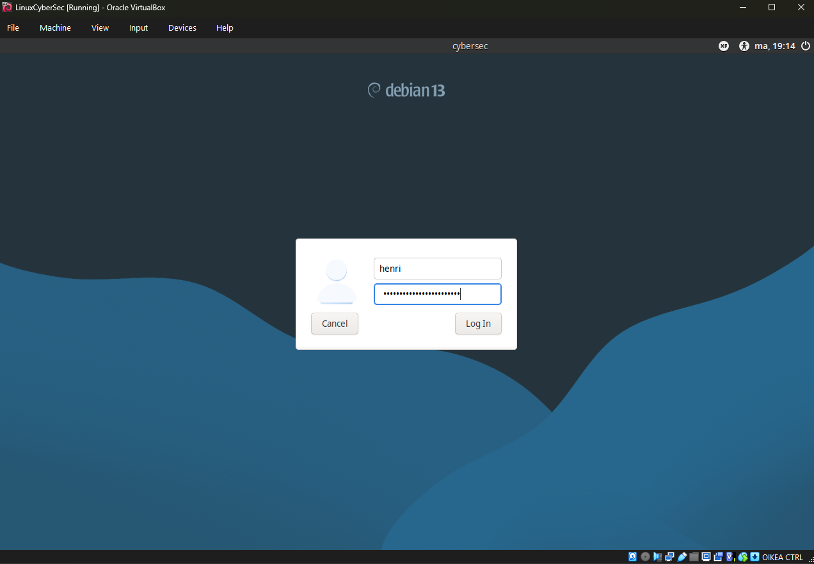
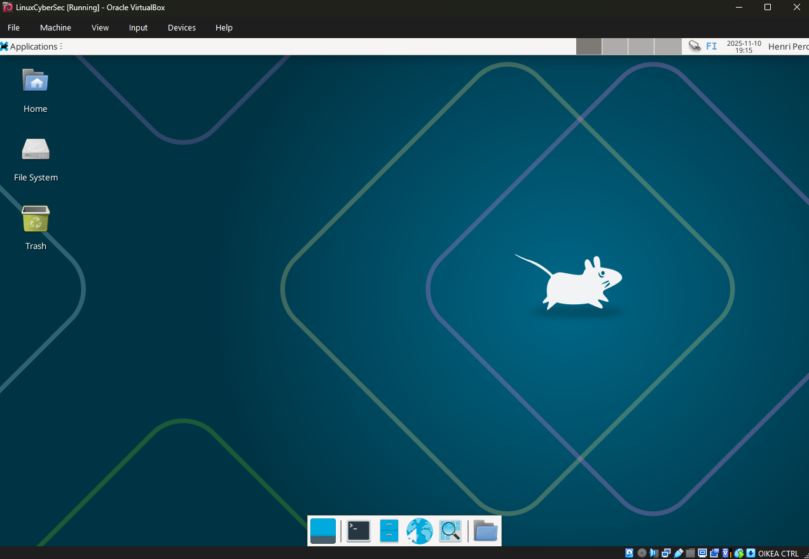

### Step 16: Performing Initial System Setup After Installation

After logging into the freshly installed Debian system, I opened the terminal.

First, I updated the package list by running:

```

sudo apt-get update

```

This ensured that the system was aware of the latest available packages.

Next, I installed the `unattended-upgrades` package to enable automatic security updates:

```
sudo apt-get -y install unattended-upgrades

```

Then I upgraded all installed software to the latest versions available for Debian by running:

```

sudo apt-get -y dist-upgrade

```

The `-y` flag automatically accepted all prompts, and `dist-upgrade` upgraded all packages.

Next, I installed a firewall and enabled it using:

```

sudo apt-get -y install ufw
sudo ufw enable

```

Finally, I rebooted the system via the **Log out → Restart** menu to complete the setup.

### Step 17: Installing VirtualBox Guest Additions

To improve integration between the host and the Debian virtual machine (e.g., screen resizing, clipboard sharing), I installed the VirtualBox Guest Additions.

First, I selected **Devices → Insert Guest Additions CD image...** from the VirtualBox menu. This mounted a virtual CD-ROM inside the VM.

Then I opened a terminal and navigated to the mount location using:

```

cd /media/henri/VBox_GAs_7.2.4/

```

I verified the contents with:

```

ls

```

Finally, I ran the installer script:

```

sudo bash VBoxLinuxAdditions.run

```

After the installation completed successfully, I restarted the virtual machine by logging out and selecting **Restart** from the top-left Applications menu.

## c) Crack

In this task, I successfully used Hashcat to crack a password hash. This exercise demonstrated the effectiveness of dictionary attacks using widely available tools and wordlists.

### Step 1: Installing Hashcat

I began by opening a terminal in Debian and updating the package list with:

```

sudo apt-get update

```

Then I installed the required tools using:

```

sudo apt-get -y install hashid hashcat wget

```

This installed Hashcat, HashID (for hash identification), and wget (for downloading files).


### Step 2: Creating a Working Directory and Downloading the Wordlist

To organize my files, I created a new directory in my home folder by running:

```

mkdir hashed

```

Then I navigated into it:

```

cd hashed

```

I used `wget` to download the `rockyou.txt.tar.gz` password wordlist:

```

wget https://github.com/danielmiessler/SecLists/raw/master/Passwords/Leaked-Databases/rockyou.txt.tar.gz

```

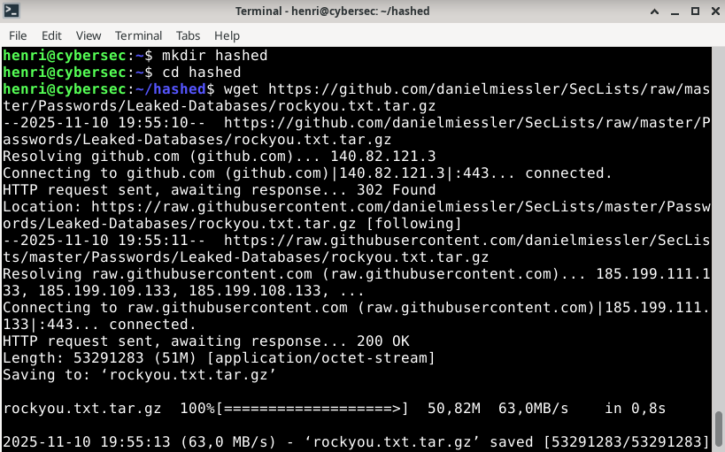

### Step 3: Extracting the Wordlist and Verifying the Wordlist Contents

After downloading the archive, I extracted it using:

```

tar xf rockyou.txt.tar.gz

```

Then I cleaned up by removing the archive file:

```

rm rockyou.txt.tar.gz

```

To preview the content, I used:

```

head rockyou.txt

```

This showed the first few entries of the wordlist. I also counted how many passwords it contained using:

```

wc -l rockyou.txt

```

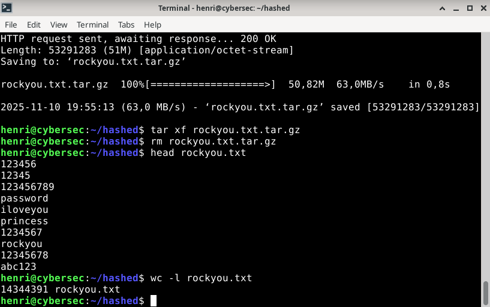

### Step 4: Identifying the Hash Type

I identified the hash type using the `hashid` command:

```

hashid -m 6b1628b016dff46e6fa35684be6acc96

```

This suggested the most likely type of hash, which I used to determine the correct mode in Hashcat.


### Step 6: Running Hashcat

I executed Hashcat using the following command:

```

hashcat -m 0 '6b1628b016dff46e6fa35684be6acc96' rockyou.txt -o solved.txt

```

- `-m 0` specified MD5 hash mode  
- `6b1628b016dff46e6fa35684be6acc96` was the hash string I was attempting to crack  
- `rockyou.txt` was the wordlist  
- `-o solved.txt` saved the cracked password if successful

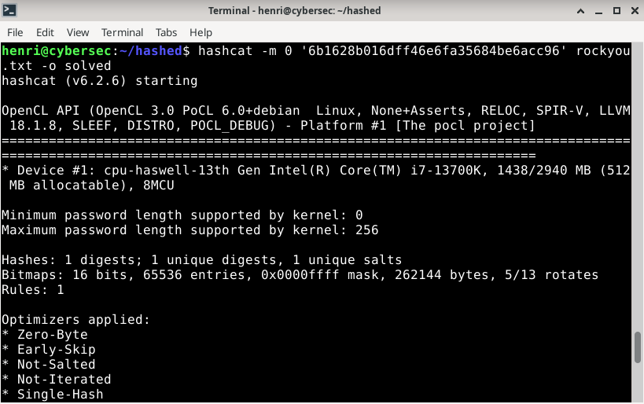

### Step 8: Confirming the Cracked Password

After the cracking process completed, I displayed the results with:

```

cat solved.txt

```

The file showed the cracked password: `summer`, which confirmed that the process was successful.

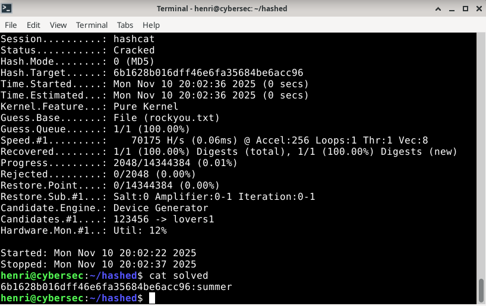

## d) John the Ripper

In this exercise, I successfully used John the Ripper to crack a password for a protected zip archive. The steps involved compiling the tool, converting the zip file to a hash, and cracking it.

### Step 1: Installing Required Packages

I began by opening a terminal and updating the package list:

```

sudo apt-get update

```

Next, I attempted to install the necessary dependencies for compiling John the Ripper. One package failed (`zlib-gst`), so I removed it from the list and re-ran the command, which completed successfully.

```

sudo apt-get -y install micro bash-completion git build-essential libssl-dev zlib1g zlib1g-dev zlib-gst libbz2-1.0 libbz2-dev atool zip wget

```

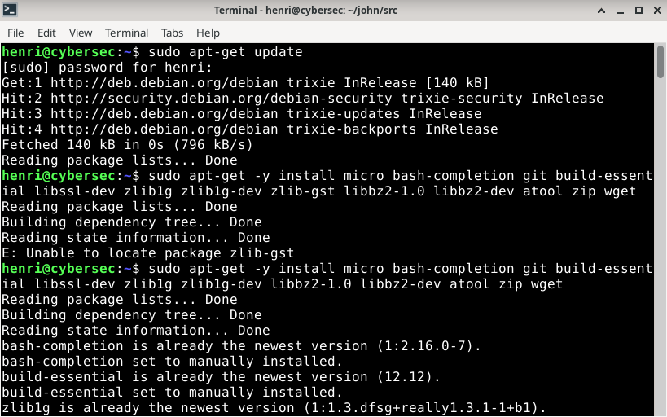

### Step 2: Cloning the Repository and Configuring the Build

After installing dependencies, I cloned the John the Ripper source code using:

```

git clone --depth=1 https://github.com/openwall/john.git

```

I changed into the source directory:

```

cd john/src/

```

Then I ran the configuration script:

```

./configure

```

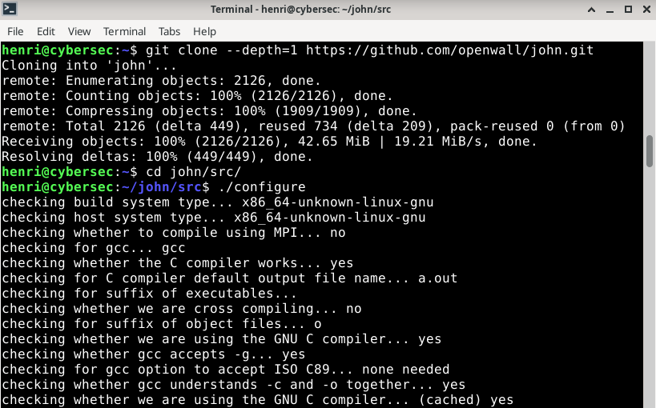

### Step 3: Compiling John the Ripper

Then I compiled the project using:

```

$ make -s clean && make -sj8

```

The `-sj8` option allowed compilation using 8 parallel jobs for speed.

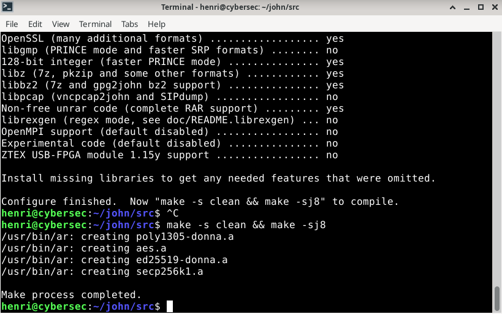

### Step 4: Navigating to the Run Directory

Once compilation was complete, I moved into the run directory:

```

cd ../run/

```

I listed the contents with:

```

ls -1

```

This directory contained the `john` executable and supporting files.

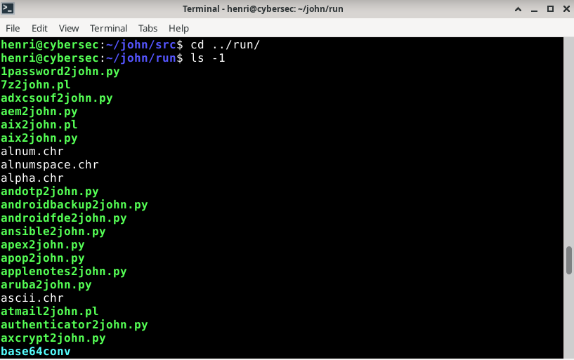

### Step 5: Running John the Ripper from the Home Directory

I navigated back to my home directory:

```

cd

```

Then I executed John the Ripper directly from the run folder:

```

$HOME/john/run/john

```

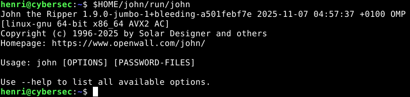

### Step 6: Downloading a Zip File

I downloaded a zip file using:

```

wget https://TeroKarvinen.com/2023/crack-file-password-with-john/tero.zip

```

After downloading, I attempted to unzip it:

```

unzip tero.zip

```

The system prompted for a password, which I didn’t have.

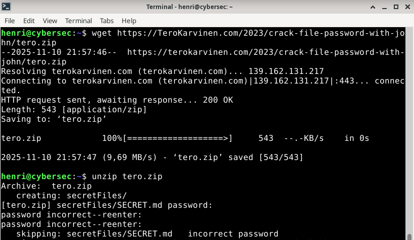

### Step 7: Cracking the Zip File Password

To crack the password, I first converted the zip file into a hash format with:

```

$HOME/john/run/zip2john tero.zip >tero.zip.hash

```

Then I launched John the Ripper with:

```

$HOME/john/run/john tero.zip.hash

```

After some time, John the Ripper successfully cracked the password: `butterfly`.

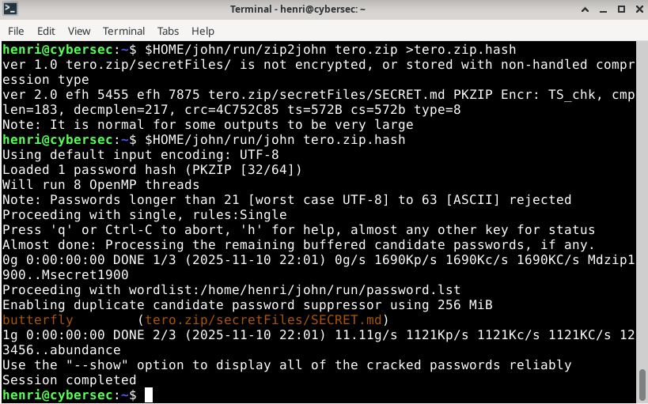

### Step 8: Extracting the Zip File with the Cracked Password

With the password in hand, I ran:

```

unzip tero.zip

```

I entered the password `butterfly` when prompted. The archive was extracted successfully.

Inside the extracted directory, I found a file named `secret.md`, which I viewed using:

```

cat secretFiles/SECRET.md

```

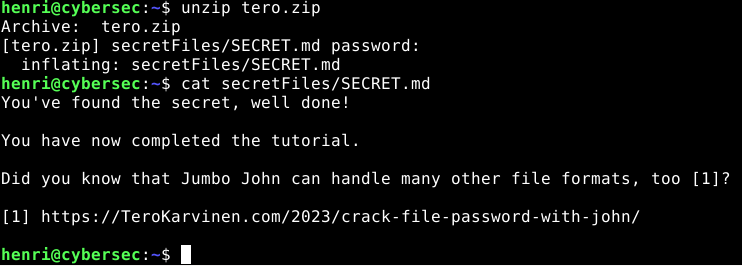

## Sources

Karvinen, T. 2020. Command Line Basics Revisited. URL: https://terokarvinen.com/2020/command-line-basics-revisited/. Accessed: 9 November 2025.

Karvinen, T. 2022. Cracking Passwords with Hashcat. URL: https://terokarvinen.com/2022/cracking-passwords-with-hashcat/. Accessed: 9 November 2025.

Karvinen, T. 2025. Cyber Security. URL: https://terokarvinen.com/cyber-security/#h3-cyber-lab. Accessed: 9 November 2025.
