# h4 Feed me

Homework 4 for Haaga-Helia’s Cyber Security course (Karvinen 2025).

## x) Why would you want to use a feed reader? Couldn't you just browse to each website?

* A feed reader automatically gathers updates from your favorite websites in one place, "river of news", saving time.
* It ensures you never miss new posts or articles, as updates appear instantly.
* It allows you to read headlines or summaries without visiting each site separately.
* It helps you securely follow trusted security feeds (e.g., security alerts, threat intelligence blogs, vendor advisories).
* It helps avoid ads, pop-ups, and clutter often found on websites.
* You stay in control of your information sources instead of relying on a random social media algorithm to decide what you see.

## y) Supreme court of Finland, case Osuuspankkikeskus port scan KKO:2003:36

The following is a summary of Supreme Court (2003) _KKO:2003:36_:

* Doing a port scan on someone else’s network without permission can be a crime in Finland if it is done to find ways to access the system, even when the scan does not go through the firewall.
* A 17-year-old computer hobbyist had scanned the network of Osuuspankkikeskus (a large Finnish bank) with a port scanning program to find open proxy servers.
* The scan did not break through the firewall, but the court said this was still an attempted computer break-in.
* The reason was that port scanning can be used to look for weak points in a system and prepare for unauthorized access.
* The court did not believe the person’s claim that the scan was only done out of curiosity.
* The conviction was confirmed for attempted computer break-in.
* The costs of the investigation done by the bank were seen as real damage caused by the act.
* Even though the person was only 17, the court did not lower the compensation, because he was skilled with computers and knew the risks.

## a–c) Install a feed reader, add the feeds for Krebs and Schneier on Security

In this assignment, I successfully installed the Brief RSS feed reader extension in Firefox, learned how to subscribe to feeds, and added two security-related blogs: Krebs on Security and Schneier on Security. The feed reader now displays new articles from both blogs directly in the Brief interface.

### Step 1: Installing the feed reader add-on

I opened Firefox and navigated to the Mozilla Firefox Add-ons website. In the search bar, I searched for the “Brief” extension. Once I located the correct page (Mozilla 2025), I clicked **“Add to Firefox”** to install the extension.

After clicking “Add to Firefox,” a dialog appeared asking for various permissions required by the Brief extension. I reviewed the list of requested permissions and confirmed the installation by clicking **“Add”**. Firefox then displayed a notification stating that the extension was successfully installed.

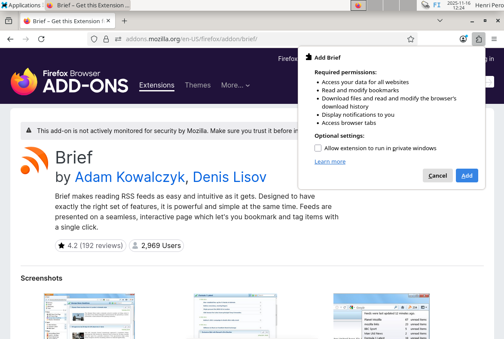

### Step 2: Opening the Brief extension

To open Brief, I clicked the Extensions button in the Firefox toolbar and selected **Brief** from the list. This launched the feed reader interface, which was initially empty since no feeds had been added yet. I clicked the **“See how to do it!”** link provided, which opened a short guide explaining how to subscribe to RSS feeds.

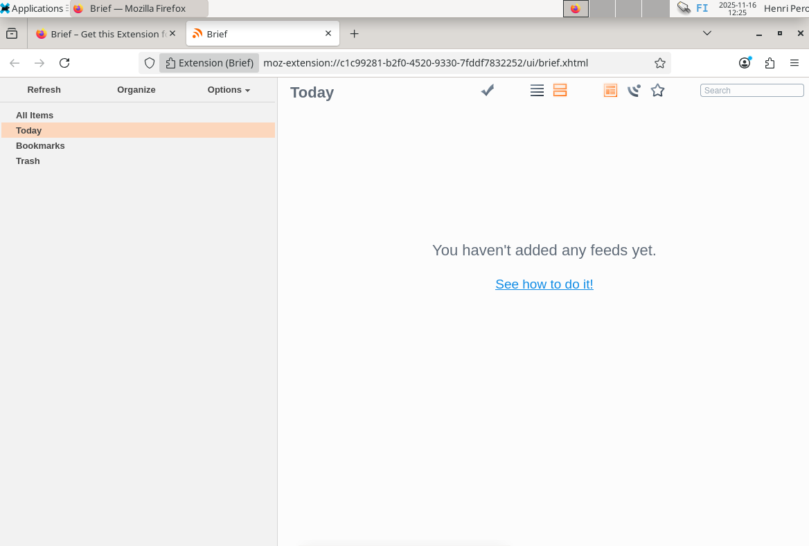

### Step 3: Adding a feed: Krebs on Security

To add the **Krebs on Security** feed, I opened a new tab and visited: https://krebsonsecurity.com/feed/. This opened the RSS feed in the browser. I clicked **“Subscribe to this feed”**, which automatically added it to the Brief reader.

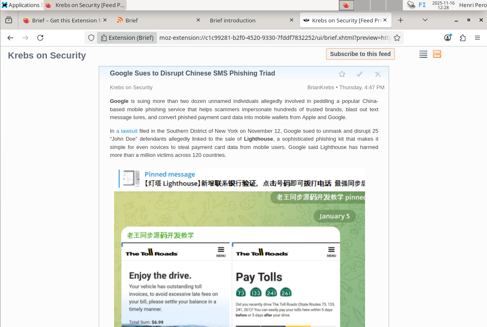

### Step 4: Adding a feed: Schneier on Security

To subscribe to **Schneier on Security**, I went to the blog’s homepage and located the **“Subscribe”** button (https://www.schneier.com/feed/atom/). Then I clicked **“Subscribe to this feed”** to add it to Brief.

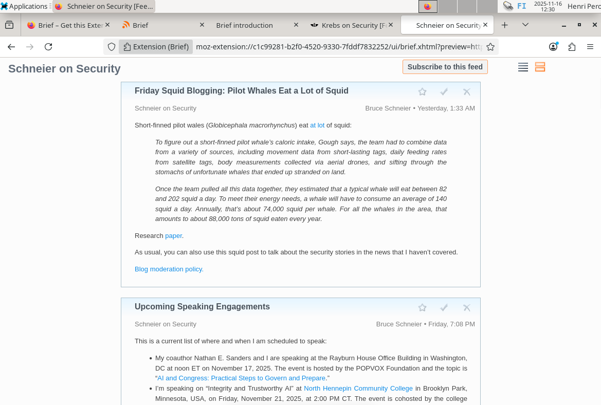

### Step 5: Viewing subscribed feeds in Brief

After subscribing to the two blogs, I opened the Brief extension. Inside the Brief interface, I selected **All Items** from the left-hand menu.

This view displayed the latest articles from both subscribed feeds: **Krebs on Security** and **Schneier on Security**. I confirmed that the most recent posts from both sources were listed, indicating that the subscriptions were active and functioning correctly.

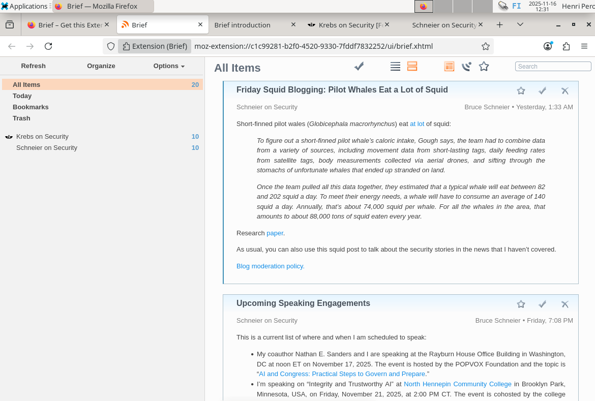

## d) Find and add two more security related feeds

* Traficom – Information Security Now!
  * https://www.kyberturvallisuuskeskus.fi/feed/rss/fi/399
  * Found it from previous coursework and the National Cyber Security Centre (2021) website.
  * I chose it because it provides up-to-date national-level security advisories, guidance, and awareness materials in the Finnish context.
* Pen Test Partners blog
  * https://www.pentestpartners.com/feed/
  * I found it from a list of the top 20 pentest RSS feeds (FeedSpot 2025), where Pen Test Partners was included.
  * It focuses on the offensive security and penetration testing side of cybersecurity.
  * The content includes, for example, tools, red-teaming, IoT vulnerabilities, and practical vulnerabilities.

## e) Follow security feeds

I followed my selected RSS feeds on Sunday. As it was the weekend, there were no new updates that day, but I explored some earlier articles from the feeds instead. I found at least two particularly interesting ones.

* **Information Security Now!**
  * One article I read was titled *“A malware can be activated unnoticed using the ClickFix technique – learn about the phenomenon and protect yourself”* (National Cyber Security Centre 2025).
  * It introduced an attack method I had not heard about before.
  * The idea is that users are accustomed to solving small verification tasks online, such as CAPTCHAs or “confirm you are human” prompts.
  * Attackers exploit this habit by tricking users into clicking what looks like a harmless button or typing certain keys.
  * In reality, this makes the victim copy malicious content to the clipboard and then, following the attacker’s instructions, open the Windows “Run” dialog (Win + R), paste the malicious command, and execute it.
  * The malware is then activated without the victim realizing anything suspicious happened.
  * I found it as a good example of social engineering.

* **Pen Test Partners Blog**
  * Another article I found interesting was *“Spot trouble early with honeypots and Suricata”* (Pen Test Partners 2025).
  * It explained how honeypots can be used to detect malicious activity early.
  * The idea is to deploy decoy systems that mimic critical business infrastructure, allowing defenders to monitor attack behavior safely.
  * These systems can also be integrated with other security tools, enabling organizations to analyze incoming threats and improve their overall protection.
  * I found it insightful how such traps can turn attackers’ actions into valuable intelligence for defense.

**Benefits:**

* RSS feeds gather updates from multiple trusted sources into one place, making it efficient to follow the cybersecurity scene.
* You can easily browse headlines and summaries to decide which articles are worth reading.
* Feeds provide direct access to original content without the noise of social media algorithms.

**Downsides:**

* Feeds lack community interaction and discussion that social media platforms can offer.
* It becomes yet another separate place to check for updates, alongside email newsletters, Teams, social media, and other information channels.

## f) Port scan

In this task, I successfully installed Nmap, configured and started the Apache web server, and performed local port scans. Nmap correctly identified active services on ports 80 and 631, demonstrating its ability to detect and report open ports and service versions.

### Step 1: Installing Nmap

I began by opening a terminal, updating the package list and installing Nmap:

```
sudo apt-get update
sudo apt-get install nmap -y
```

The `-y` flag automatically accepted any prompts during installation.

### Step 2: Disconnecting the network

Before performing a port scan, I disconnected the virtual machine from the internet. In VirtualBox, I went to **Devices → Network** and unchecked the connected adapter. I confirmed the disconnection by running:

```
ping 8.8.8.8
```

The system returned a “network is unreachable” message.

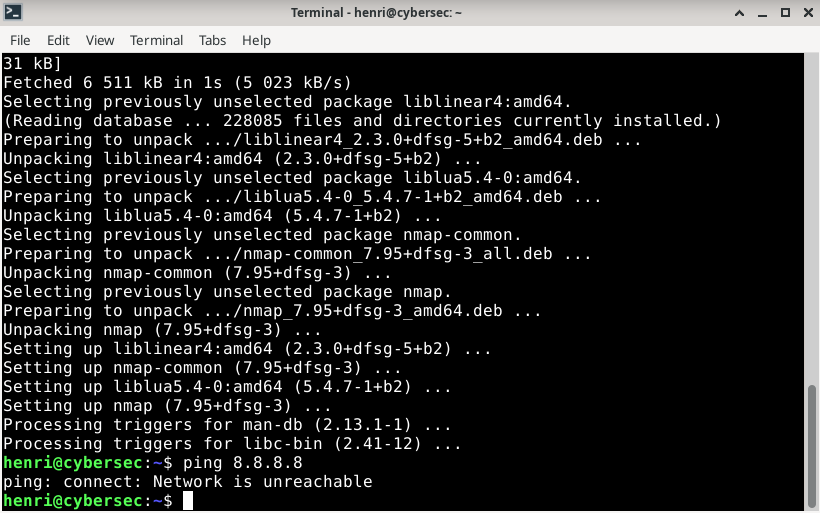

### Step 3: Running an Nmap scan on localhost

With the network disconnected, I scanned the local machine by running:

```
sudo nmap -A -v localhost
```

The `-A` option enabled aggressive scan features (e.g. OS and version detection), and `-v` enabled verbose output.

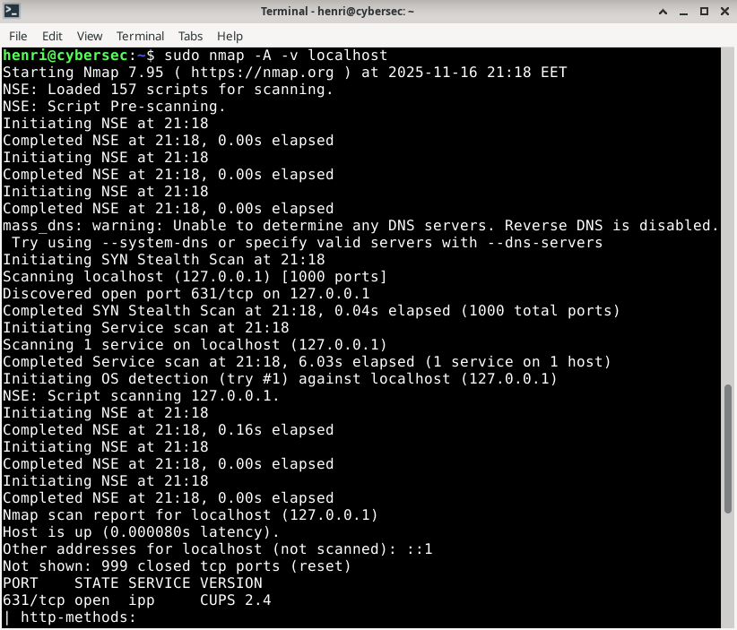

### Step 4: Viewing the Nmap scan results

The scan results showed that port `631/tcp` was open. The service running on this port was identified as IPP (Internet Printing Protocol), and the version was CUPS 2.4.

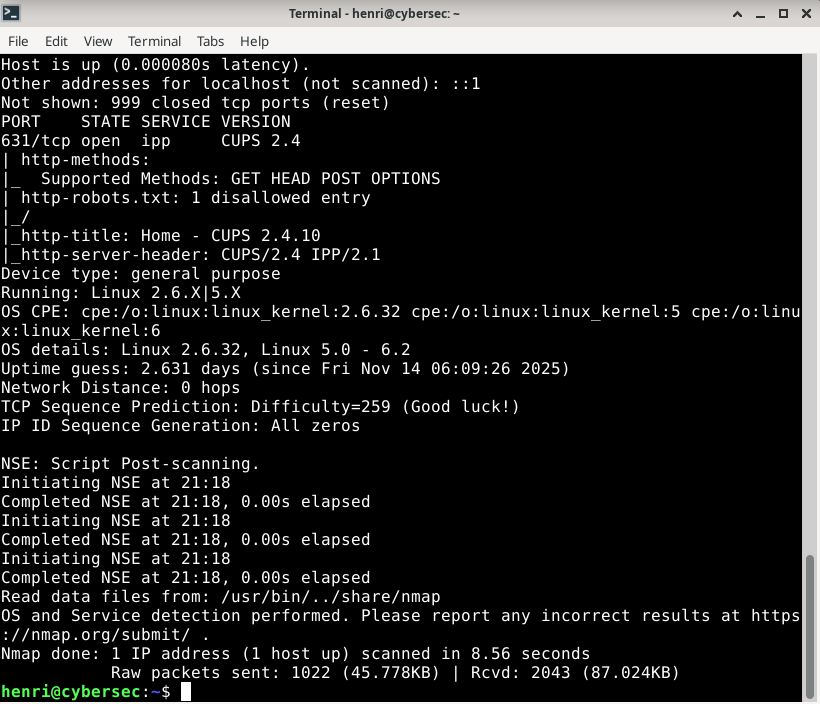

### Step 5: Reconnecting to the internet and installing Apache

To install a new service, I reconnected the virtual machine to the internet via **Devices → Network** in VirtualBox. Once connected, I installed the Apache HTTP server and manually started it:

```
sudo apt-get install apache2 -y
sudo systemctl start apache2
```

Now Apache was running and port `80/tcp` was expected to be open.

### Step 6: Disconnecting the network and running the port scan again

I once again disabled the network adapter in VirtualBox to simulate a local-only environment. After confirming the network was offline with `ping 8.8.8.8`, I reran the same Nmap command:

```
sudo nmap -A -v localhost
```

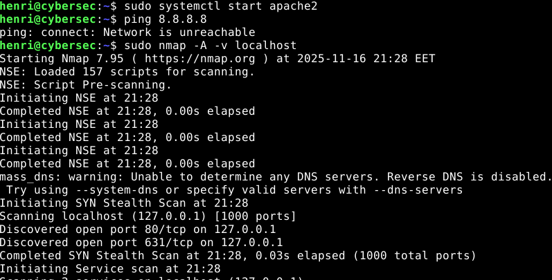

### Step 7: Reviewing the final scan results

The final scan results showed two open ports:

- `80/tcp` running **Apache HTTPD 2.4.56** (HTTP)
- `631/tcp` running **CUPS 2.4** (IPP)

This confirmed that both the printing service and the newly installed web server were correctly detected.

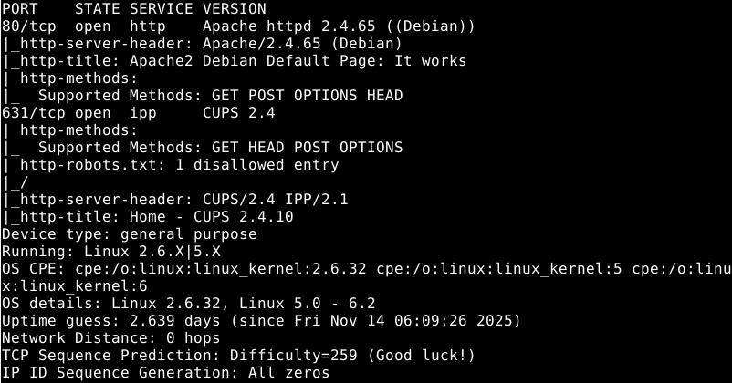

I verified the scan results by browsing the corresponding web pages in Firefox.

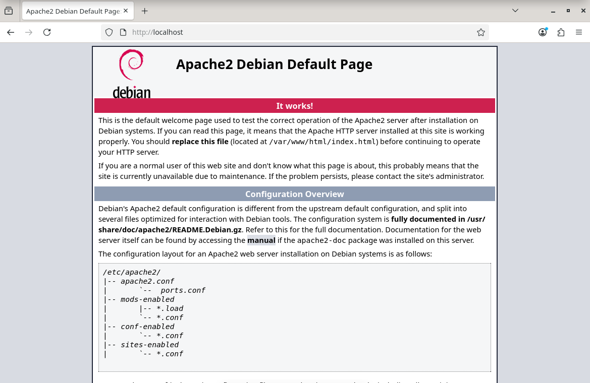

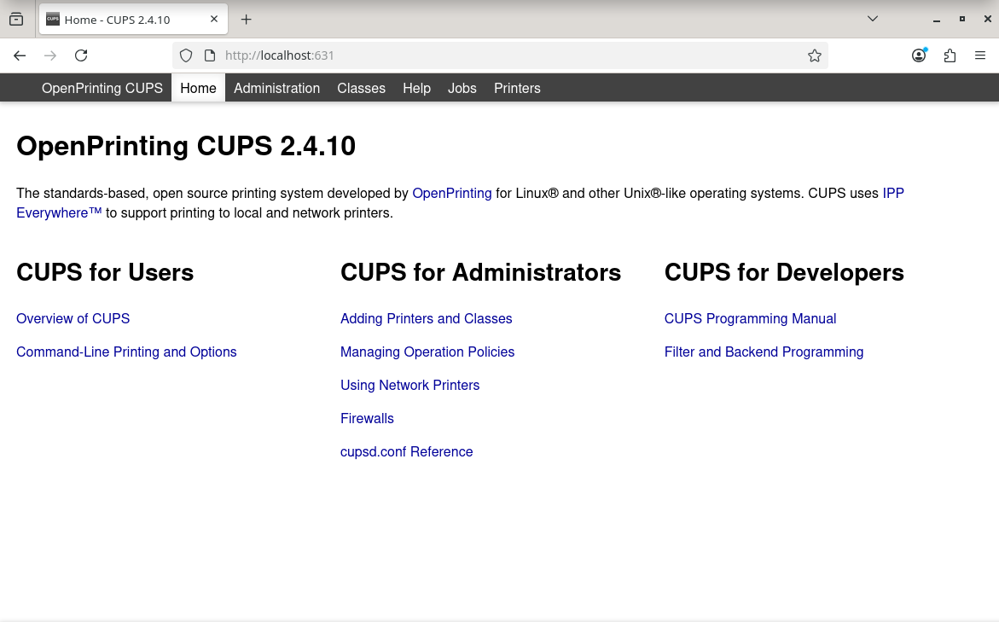

## Sources

FeedSpot 2025. Top 20 Pentest RSS Feeds. URL: https://rss.feedspot.com/pentest_rss_feeds/. Accessed: 16 November 2025.

Karvinen, T. 2025. Cyber Security. URL: https://terokarvinen.com/cyber-security/#h4-feed-me. Accessed: 16 November 2025.

Mozilla 2025. Brief. URL: https://addons.mozilla.org/en-US/firefox/addon/brief/. Accessed: 16 November 2025.

National Cyber Security Centre 2021. RSS feeds. URL: https://www.kyberturvallisuuskeskus.fi/en/ncsc-news/rss-feeds. Accessed: 16 November 2025.

National Cyber Security Centre 2025. Haittaohjelma voidaan aktivoida huomaamatta ClickFix-tekniikan avulla - Tutustu ilmiöön ja suojaudu. URL: https://www.kyberturvallisuuskeskus.fi/fi/ajankohtaista/haittaohjelma-voidaan-aktivoida-huomaamatta-clickfix-tekniikan-avulla-tutustu-ilmioon. Accessed: 16 November 2025.

Pen Test Partners 2025. Spot trouble early with honeypots and Suricata. URL: https://www.pentestpartners.com/security-blog/spot-trouble-early-with-honeypots-and-suricata/. Accessed: 16 November 2025.

Supreme Court 2003. KKO:2003:36. URL: https://www.finlex.fi/fi/oikeuskaytanto/korkein-oikeus/ennakkopaatokset/2003/36. Accessed: 16 November 2025.
