# h5 Alice and Bob

Homework 5 for Haaga-Helia’s Cyber Security course (Karvinen 2025).

## x) Read and summarize

The following is a summary of Schneier (2015):

* Chapter 1 - Foundations
  * 1.1 Terminology
    * Cryptography is the science of keeping messages secure to prevent eavesdroppers from reading communications between a sender and a receiver.
    * Encryption hides plaintext (message) by converting it into ciphertext.
    * Decryption restores ciphertext back to plaintext.
    * Plaintext (M) and ciphertext (C) are both binary data; encryption and decryption are represented mathematically as `E(M) = C` and `D(C) = M`.
    * For encryption and decryption to work correctly, `D(E(M)) = M`.
    * In addition to confidentiality, cryptography must provide authentication (verifying origin), integrity (verifying no modification), and nonrepudiation (preventing the sender from denying the message).
    * Restricted algorithms rely on secrecy of the algorithm itself, which makes them insecure and impractical.
    * Modern cryptography uses a key to secure algorithms; the algorithm can be public as long as the key remains secret.
    * Some systems use two different keys: an encryption key and a decryption key.
    * Symmetric algorithms use the same key (or a derivable pair) for encryption and decryption. The sender and receiver must share the key securely before communication.
    * Public-key (asymmetric) algorithms use different keys for encryption and decryption. The encryption key is public, while the decryption key is private and kept secret.
    * In asymmetric systems, the private decryption key cannot be calculated from the public encryption key in a reasonable amount of time.
    * Public-key encryption allows anyone to send encrypted messages, but only the private key holder can decrypt them.
    * Digital signatures reverse the public-key process; encryption with the private key and decryption with the public key can verify the sender’s authenticity.
* Chapter 2 - Protocol Building Blocks
  * 2.5 Communications Using Public-Key Cryptography
    * Symmetric cryptography is like a safe where everyone needs the same combination, whereas public-key cryptography is like a mailbox where anyone can deposit a message, but only the owner can retrieve it.
    * In 1976, Diffie and Hellman introduced public-key cryptography, using two keys: one public for encryption and one private for decryption.
    * The public key can be shared openly; the private key must be kept secret.
    * Encrypting with a public key is easy, but decrypting without the private key is computationally infeasible.
    * Public-key cryptography is based on trapdoor one-way functions — easy to compute in one direction, hard to reverse without the secret.
    * Example process:
      1. Alice and Bob agree on a public-key system.
      2. Bob sends his public key to Alice.
      3. Alice encrypts her message with Bob’s public key.
      4. Bob decrypts it using his private key.
    * This system solves the key-distribution problem of symmetric encryption, because no prior secret exchange is needed.
    * In larger networks, users can publish their public keys in a database, allowing secure communication without direct key exchange.
    * Because public-key cryptography is slow and vulnerable to chosen-plaintext attacks, modern systems use a "hybrid cryptosystem".
    * In a chosen-plaintext attack, an attacker encrypts all possible plaintexts using the public key and compares results to discover the original message.
    * Symmetric systems are not vulnerable because the key is secret.
    * A hybrid cryptosystem combines both methods:
      1. Bob sends his public key.
      2. Alice generates a random session key and encrypts it with Bob’s public key.
      3. Bob decrypts it with his private key to recover the session key.
      4. Both use the session key for fast symmetric encryption.
    * Session keys are temporary and destroyed after use, reducing risk of compromise.
    * The private key remains safer as it is used only to encrypt session keys, not entire messages.
    * Merkle’s Puzzles in 1974 were an early concept of public-key cryptography. The system used many encrypted “puzzles” that were easy for sender and receiver but much harder for an eavesdropper to solve.

The following is a summary of Karvinen (2023):

* This tutorial demonstrates how to send secure messages using the `gpg` (GNU Privacy Guard) tool on Linux, simulating a conversation between two users, Alice and Tero.
* PGP encryption ensures confidentiality so no one else can read the message, while signing ensures integrity and proves the sender's identity.
* Each user must generate a keypair using `gpg --gen-key`, consisting of a private secret key and a shareable public key.
* Public keys allow users to establish trust without meeting physically, but fingerprints should be verified via a secondary channel (like a phone call).
* To simulate a second user (Alice) on the same machine, the tutorial uses a separate directory and the `--homedir` flag to isolate her configuration and keyring.
* Users export their public keys using the `--armor` flag to create ASCII-formatted text blocks that are safe to copy-paste or email.
* Alice imports Tero's public key (`--import`), verifies his fingerprint matches what he says over the phone, and digitally signs his key (`--sign-key`) to mark it as trusted.
* Tero repeats this process to import and trust Alice's public key so he can verify her signatures later.
* Alice encrypts a message file using Tero's public key (`--encrypt --recipient`) and simultaneously signs it with her private key (`--sign`).
* The resulting output is an ASCII-armored `.pgp` file containing the ciphertext, which can be safely sent over an untrusted network.
* Tero uses `gpg --decrypt` to open the file; this requires his private key to decrypt the content.
* Upon decryption, the system displays the original message and confirms the sender's identity with a "Good signature" status.
* The process confirms that the message was not read by eavesdroppers and was not modified during transit.

## a) Pubkey today

Today I visited `https://terokarvinen.com/`, which uses HTTPS (TLS) to protect web traffic. This relies on public-key cryptography to make sure the connection is both encrypted and trusted (Internet Society s.a.).

* When I opened the site, my browser received a digital certificate issued to `terokarvinen.com` by Let’s Encrypt.
  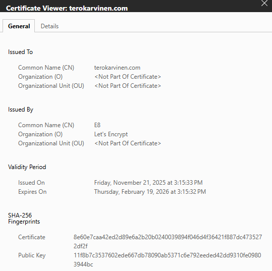
* The certificate includes the site’s public key, while the private key is safely stored on the server.
* My browser verified that the certificate was genuine by checking the Let’s Encrypt signature with a trusted Certificate Authority public key.
* After trust was confirmed, my browser used the site’s public key to establish a temporary session key for encryption.
* From that point on, all communication between my browser and the website was encrypted using symmetric encryption for speed.

This everyday use of HTTPS shows how public-key cryptography protects ordinary web browsing by ensuring that I’m really connected to terokarvinen.com and that no one can read or alter the data in transit.

## b) Encrypt a message, f) Details of PGP

In this task, I successfully generated key pairs for Henri and Alice, established mutual trust by signing each other’s public keys, encrypted and signed a secret message as Alice, and delivered it securely to Henri.

### Key Usage in the Process

To secure the communication, different keys served specific purposes:
* Confidentiality: The message was encrypted using the recipient’s (Henri’s) public key.
* Authenticity: The message was signed using the sender’s (Alice’s) private key.
* Decryption and verification: Henri used his private key to decrypt the message and Alice’s public key to verify the signature.

### Security Evaluation and Tool Description

I utilized GnuPG (GPG), which is the industry-standard, open-source implementation of the OpenPGP protocol (RFC 4880). According to Milo, Bernaschi, and Bisson (2011, 2088), GnuPG is considered a "solid and reliable" software package widely used for private communication. The authors explain that the standard achieves security by combining strong symmetric and public-key cryptography algorithms to provide confidentiality, key management, and digital signature services. (Milo, Bernaschi & Bisson 2011, 2088.)

### Step 1: Installing Required Tools for PGP

I opened a terminal and updated the package list. Then I installed the necessary packages for PGP:

```
sudo apt-get update
sudo apt-get install gpg micro psmisc
```

### Step 2: Generating a PGP Key Pair for Henri

I generated Henri’s key pair with:

```
gpg --gen-key
```

I provided the name `Henri` and email `henri@example.com.invalid`. I chose to leave the passphrase empty and confirmed the warning. GPG generated Henri’s public and private key pair. In a real-world scenario, leaving the passphrase empty (as I did for this simulation) would be a security risk. If an attacker stole the private key file, they could use it immediately. A strong passphrase acts as a second layer of defense.

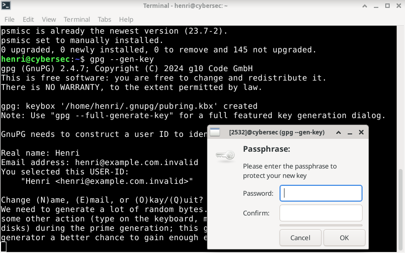

### Step 3: Viewing Henri’s Public Key Fingerprint

I displayed Henri’s public key fingerprint with:

```
gpg --fingerprint
```

This confirmed the key was created correctly. The private key was not shown.

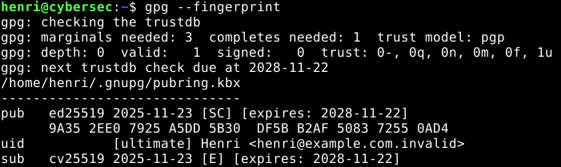

### Step 4: Exporting Henri’s Public Key

I returned to the home directory. Then exported the public key in ASCII format:

```
cd
gpg --export --armor --output henri.pub
```

### Step 5: Verifying the Exported Public Key

I listed the files. Then confirmed the export succeeded by viewing the start of the file:

```
ls
head -4 henri.pub
```

The output began with `-----BEGIN PGP PUBLIC KEY BLOCK-----`.

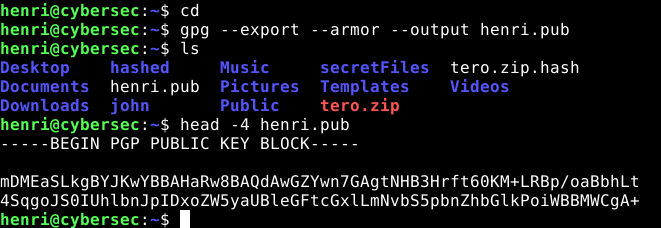

### Step 6: Simulating Alice’s Environment

I created a new directory and restricted its permissions:

```
mkdir alice/
chmod og-rwx alice/
cd alice/
```

I initialized Alice’s GPG environment:

```
gpg --homedir . --fingerprint
```

### Step 7: Generating a PGP Key Pair for Alice

Inside the `alice` directory, I ran:

```
gpg --homedir . --gen-key
```

I entered Alice’s name and email, left the passphrase empty, and confirmed the warnings. A new key pair was generated.

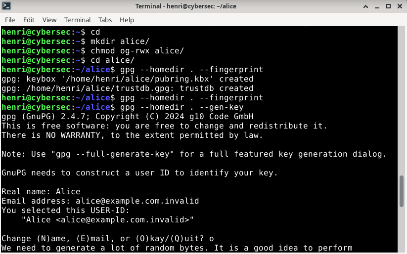

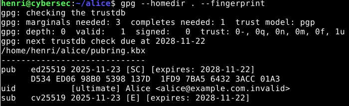

### Step 8: Importing Henri’s Public Key into Alice’s Keyring

I copied Henri’s key:

```
cd
cp -v henri.pub alice/
cd alice/
```

Then imported it:

```
gpg --homedir . --import henri.pub
```

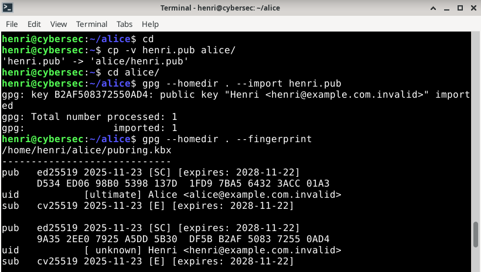

I verified the fingerprint with Henri via a simulated secure channel and signed the key:

```
gpg --homedir . --sign-key "9A35 2EE0 7925 A5DD 5B30  DF5B B2AF 5083 7255 0AD4"
```

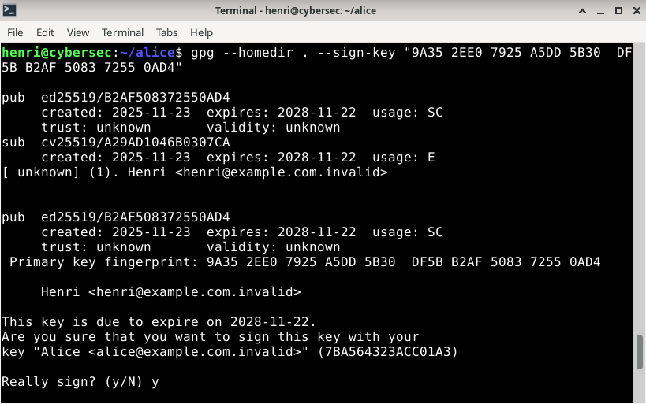


### Step 9: Exporting and Importing Alice’s Public Key

As Alice, I exported her public key:

```
gpg --homedir . --export --armor --output alice.pub
```

I switched back to Henri’s environment:

```
cd
cp -v alice/alice.pub .
gpg --import alice.pub
```

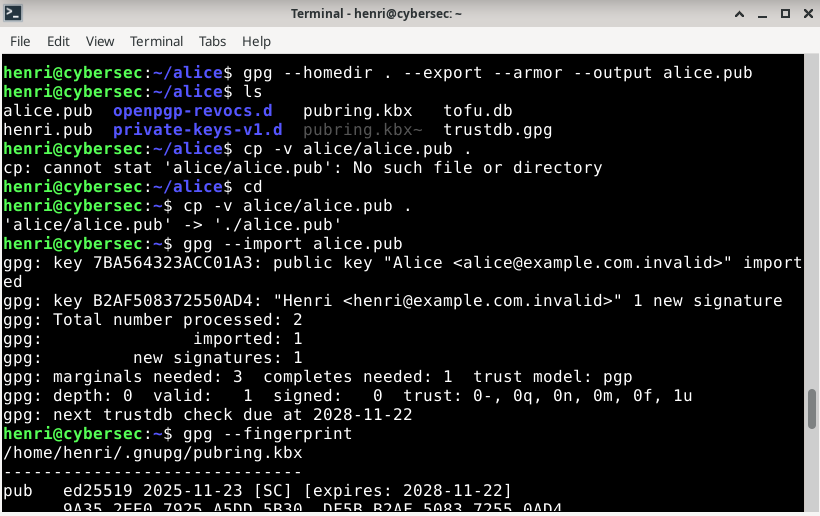

I verified Alice’s key fingerprint and signed it:

```
gpg --sign-key "D534 ED06 98B0 5398 137D  1FD9 7BA5 6432 3ACC 01A3"
```

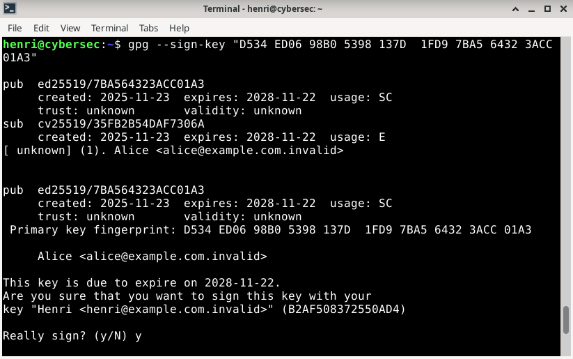

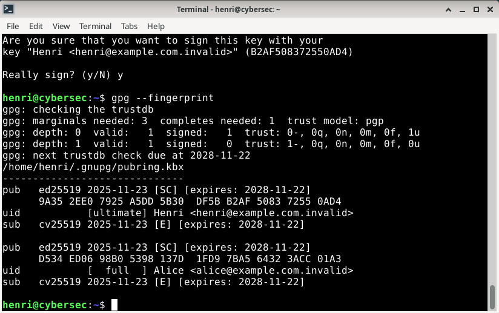

### Step 10: Creating a Secret Message as Alice

I switched back to the Alice environment. Then wrote a message using:

```
cd alice
micro message.txt
```


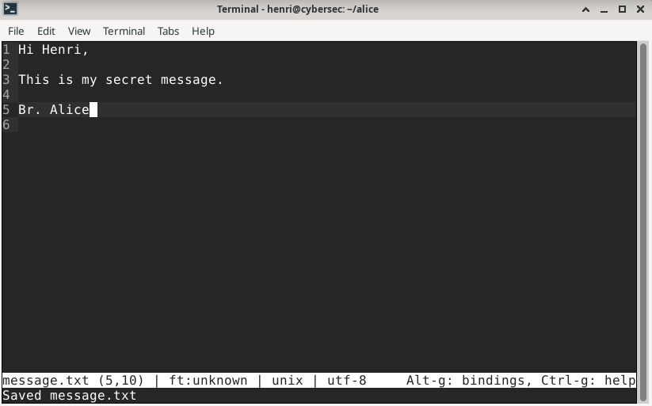

After writing the message, I saved with `Ctrl+S` and exited with `Ctrl+Q`.

### Step 11: Encrypting and Signing the Message

Alice encrypted and signed the message with:

```
gpg --homedir . --encrypt --recipient henri@example.com.invalid --sign --output encrypted.pgp --armor message.txt
```

She confirmed the file was created correctly with:

```
head -4 encrypted.pgp
```

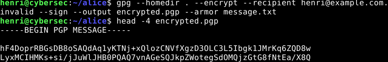

### Step 12: Simulating Message Transfer to Henri

To simulate the message transfer, I copied the file to Henri’s environment:

```
cd
cp -v alice/encrypted.pgp .
```

Henri now had the encrypted message ready to decrypt.

### Step 13: Decrypting and Verifying the Message as Henri

Once Henri received the `encrypted.pgp` file from Alice, he proceeded to decrypt it using his private key. I ran the following command:

```
gpg --decrypt encrypted.pgp
```

The output confirmed that the message was:

* Encrypted with Henri’s public key.
* Digitally signed by Alice using her private key.
* Successfully verified as a good signature from `Alice <alice@example.com.invalid>`.

The decrypted message content read:

```
Hi Henri,

This is my secret message.

Br. Alice
```

This confirmed that the encryption, signature, and trust mechanisms worked correctly.

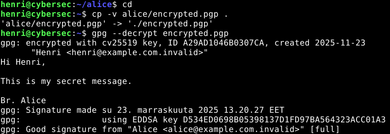

## c) Eve and Mallory

In cryptography, Eve and Mallory represent two distinct types of threats. PGP protects against both through different mechanisms: encryption (confidentiality) and digital signatures (integrity and authentication).

In my prevous task, by combining both flags (`--encrypt` and `--sign`) into a single command, I ensured that Eve could not read the message and Mallory could not alter it without detection.

### 1. Protection against Eve

Eve intercepts the communication channel and captures the file `encrypted.pgp`. Her goal is to read the contents of the secret message.

PGP protects against Eve by turning the plaintext message into unreadable ciphertext. Even though Eve has the file, she cannot derive the content because she lacks the necessary decryption key.

* **Key used:** The message is encrypted using the recipient's public key (Henri's public key).
* **Mechanism:** Mathematics ensures that only the paired recipient's private key (which only Henri possesses) can reverse this operation.
* **Relevant command flags:**
    * `--encrypt`: Tells GPG to apply the encryption algorithm.
    * `--recipient henri@example.com.invalid`: Specifies which public key to use for the encryption math.

### 2. Protection against Mallory

Mallory intercepts the file and modifies it before forwarding it to Henri or attempts to create a fake message pretending to be Alice.

PGP protects against Mallory by attaching a digital signature. This signature acts like a tamper-proof seal.

* **Integrity:** If Mallory modifies even a single bit of the encrypted file, the mathematical hash of the message will change. When Henri tries to verify it, GPG will calculate that the signature does not match the content and alert him.
* **Authentication:** Because the signature is created using the sender's private key (Alice's), Mallory cannot forge a valid signature for a fake message unless he steals Alice's private key.
* **Key used:** The signature is generated using the sender's private key (Alice's). Henri uses Alice's public key to verify it.
* **Relevant command flags:**
    * `--sign`: Tells GPG to calculate a hash of the message and encrypt that hash with Alice's private key.

## d) Password management

I used the command-line password manager `pass`, which securely stores passwords encrypted with my GPG key. Each password entry is an encrypted text file that only my private key can decrypt. This ensures that even if someone gains access to my password directory, they cannot read any passwords without my private key. (Donenfeld s.a.)

People who do not use password managers often:
* Reuse the same password on multiple sites → vulnerable to credential stuffing attacks.
* Choose weak or guessable passwords → vulnerable to brute-force or dictionary attacks.
* Store passwords in plain text or browsers without encryption → vulnerable to malware or data theft.

Using pass prevents these risks by generating unique, long, and random passwords for each service and storing them encrypted with a strong key.

### Step 1: Install Pass

```
sudo apt-get update
sudo apt-get install pass
```

### Step 2: Get the ID of GPG Key

This shows my GPG key ID, which will be used to encrypt passwords:
```
gpg --list-secret-keys --keyid-format LONG
```

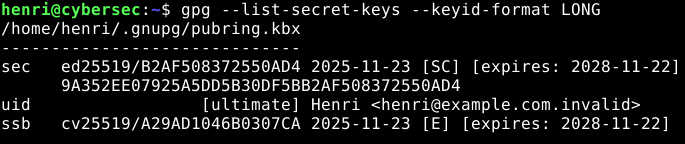

In this example, I used an existing GPG key that I already had available.
In a real-world setup, I would create a dedicated GPG key specifically for password management and protect it with a strong passphrase.

### Step 3: Initialize the Password Store

This command creates a new password store and configures it to use my GPG key for encryption:
```
pass init "B2AF508372550AD4"
```

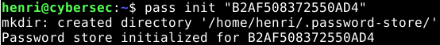

### Step 4: Use Pass

Generate a new 30-character password for `Email/example.com`:
```
pass generate Email/example.com 30
```

List all saved passwords:
```
pass
```

Show a specific password:
```
pass Email/example.com
```

Copy a password to clipboard (expires automatically after 45 seconds):
```
pass -c Email/example.com
```

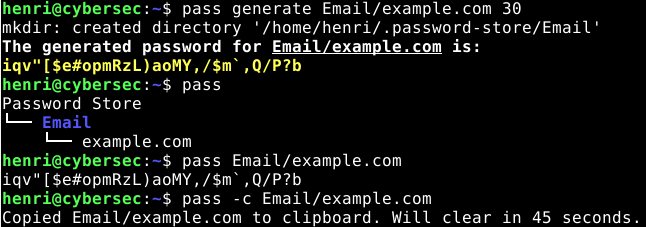

## e) Refer to sources

Already done.

## Sources

Donenfeld, J. s.a. Pass: The Standard Unix Password Manager. URL: https://www.passwordstore.org/. Accessed: 24 November 2025.

Internet Society s.a. TLS Basics. URL: https://www.internetsociety.org/deploy360/tls/basics/. Accessed: 22 November 2025.

Karvinen, T. 2023. PGP - Send Encrypted and Signed Message - gpg. URL: https://terokarvinen.com/2023/pgp-encrypt-sign-verify/. Accessed: 22 November 2025.

Karvinen, T. 2025. Cyber Security. URL: https://terokarvinen.com/cyber-security/#h5-alice-and-bob. Accessed: 22 November 2025.

Milo, F., Bernaschi, M. & Bisson, M. 2011. A Fast, GPU Based, Dictionary Attack to OpenPGP Secret Keyrings. The Journal of Systems and Software, 84, 12, pp. 2088–2096.  URL: https://doi.org/10.1016/j.jss.2011.05.027. Accessed: 23 November 2025.

Schneier, B. 2015. Applied Cryptography. Wiley. New York. E-book. Accessed: 22 November 2025.
