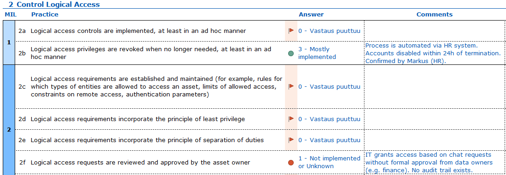

# h6 Mature

Homework 6 for Haaga-Helia’s Cyber Security course (Karvinen 2025).

## x) Read and summarize

**Traficom (s.a.) Cybermeter's user guide**

* Summary and checklist of the assessment process (p. 10)
  * Initiate (5.1): Management launches the process and appoints a facilitator.
  * Prepare (5.2): The team defines the scope, critical assets, and gathers necessary specialists.
  * Conduct (5.3): The facilitator and specialists run the evaluation using the Cybermeter tool.
  * Indetify (5.4): Results are analyzed to set target levels and prioritize development tasks.
  * Act & update (5.5): The organization implements the improvements and updates the assessment.
* 3 Cybermeter maturity model (p. 11–14)
  * Cybermeter assesses and guides the development of cybersecurity capabilities on a scale of 0 to 3, moving from weak/ad hoc activities to systematic, advanced management.
  * Maturity levels:
      * Level 0: Activities do not meet basic requirements.
      * Level 1: Basic requirements are met but are often ad hoc.
      * Level 2: Activities are documented, resourced, and have defined roles.
      * Level 3: Activities are steered by policy, performance is monitored, and development is continuous.
  * The model assesses 11 domains (such as risk management, access management, and incident response) containing 52 objectives.
  * Each objective is measured by specific "practices" (proven procedures). Practices are rated on a 4-point scale, where "Mostly implemented" and "Completely implemented" count as achieved.
  * Calculation logic:
      * Level 1 requirement: 100% of level 1 practices must be implemented.
      * Level 2 & 3 requirement: 100% of previous levels' practices plus >50% of the current level's practices must be implemented.
  * Scoring rule: The maturity level of a domain is determined by its lowest scoring objective (the "weakest link" determines the score).
  * Cumulative nature: Maturity levels are cumulative; you cannot achieve a high maturity level if the foundational (lower level) practices are not fully implemented.
* The Cybermeter maturity report (p. 23)
  * The maturity report is a detailed document designed to analyze assessment results and guide internal development, specifically targeting cybersecurity professionals and technical leads.
  * It features a bar chart displaying the organization's performance across all 11 cybersecurity domains on the 0–3 maturity scale.
  * The chart allows for immediate comparison between three data points for each domain:
      * Current Maturity Level (dark blue)
      * Previous Maturity Level (light blue)
      * Reference Group (grey), enabling benchmarking against peers.
  * Below the high-level chart, the report presents the maturity indicator level of each objective, helping to pinpoint exactly which specific tasks are dragging down the overall domain score.

**Traficom (2023) Cybermeter spreadsheet**

* The Cybermeter is an Excel-based tool.
* Its structure is divided into 11 security domains, with additional reporting sheets that provide summaries and visual overviews of the results.
* The tool is free of charge and can be downloaded directly from Traficom’s website.
* The tool supports Finnish, Swedish and English.
* No special software is needed: Excel is already widely available in most organizations.
* Because it runs entirely in Excel, it can be used fully offline, keeping all confidential information within the organization.
* It also allows easy customization, so organizations can tailor it to their needs or use only selected parts.

## a) Make-belief analysis

**Characters:**
* **Sara (Cyber Security Manager):** The cybersecurity lead running the assessment.
* **Tommi (IT Manager):** The technical implementer.
* **Markus (HR Manager):** The non-security business representative.

**Setting:**
* A meeting room at company X. The Cybermeter Excel sheet is projected on the wall. Sara, Tommi and Markus are currently working through the access domain on two specific rows: **2b** and **2f**.

**Dialogue:**

* **Sara:** "Okay, let’s move to subpoint **2b**: *'Logical access privileges are revoked when no longer needed.'* How do we handle it when someone leaves the company?"
* **Markus:** "I think we are actually very good at this. As soon as an employee’s contract end-date is confirmed in our HR system, the system automatically sends a ticket to IT. It’s a mandatory part of the offboarding checklist."
* **Tommi:** "That's correct. Actually, we automated this last year. The script runs every night at midnight. If the status in the HR database is 'Terminated', their Active Directory account is disabled immediately. No human intervention needed."
* **Sara:** "That sounds like a defined and managed process. It’s not ad-hoc; it’s systemic."
* **Markus:** "Agreed. I rely on that automation completely."
* **Sara:** "Great. I'm marking us as a **level 3** (mostly implemented) for 2b. Now, let’s look at **2f**: *'Logical access requests are reviewed and approved by the asset owner.'* So, if a marketing person needs access to the finance folder, what happens?"
* **Tommi:** "Well, usually they just send me a message on Teams. They say, 'Hey Tommi, I need to see the budget files.'"
* **Sara:** "And then?"
* **Tommi:** "If I know them, and it seems reasonable, I usually just add them to the group."
* **Markus:** "Wait, does the finance manager actually approve that? Or do you just decide?"
* **Tommi:** "Ideally the finance manager should, but he takes forever to reply to emails. So, to keep things moving, I just grant the access. We don't really have a form for it."
* **Sara:** "That is a problem. That means we don't have a formal approval chain. We rely on your personal judgment, Tommi. If you leave, the next guy won't know who should access what."
* **Markus:** "That sounds risky. We definitely don't have a process for this."
* **Sara:** "Exactly. This is ad-hoc. We are doing it, but without formal rules. I have to mark this as **level 1** (not implemented)."

## b) Sucks or succeeds

The Cybermeter is merely a tool. Its value depends entirely on how the organization utilizes it. Below is an analysis of how the process can become a waste of time versus a strategic asset.

**The Cybermeter is useless when:**

* The tool becomes a complete waste of time if the organization and its personnel do not commit to making actual changes based on the maturity assessment results.
* A lack of skills and qualifications among the personnel facilitating the tool leads to mistaken answers or missed critical details, rendering the results unreliable.
* The results become falsified and useless if the personnel involved lie about the true state of affairs or are overly optimistic to make the situation look better than it is.
* The process fails if it is performed in isolation because spreadsheets cannot think; successful analysis requires the collective input of stakeholders from different areas of the company.

**The Cybermeter is highly useful when:**

* The tool serves as an excellent, professionally curated framework that ensures the organization covers all relevant aspects of cybersecurity without building a giant fence while leaving the door open.
* It facilitates necessary cross-functional communication by forcing a conversation between IT and business stakeholders to verify if written policies actually match daily practices.
* The process transforms abstract risks into concrete data, which effectively justifies the need for budget and resources to fix specific low-maturity areas.
* Following the framework provides peace of mind by confirming that the most pressing issues are handled well, even if no immediate changes are required.

## c) Competition

There are several approaches that compete with Cybermeter, most notably international standards and the original model upon which Cybermeter is based.

**ISO/IEC 27001 Information Security Standard**

ISO/IEC 27001 is one competitor because it is a globally recognized standard that offers a formal certification, which is often required for large contracts and builds significant trust with international partners. However, unlike the free and lightweight Cybermeter, ISO 27001 is expensive and heavy to implement due to external audits and documentation requirements. This can sometimes lead to a "pass/fail" mentality where the focus shifts to compliance rather than genuine maturity improvement. (ISO 2022.)

**C2M2 (Cybersecurity Capability Maturity Model)**

The U.S. Department of Energy’s (s.a.) C2M2 model is a direct alternative since Cybermeter is essentially a Finnish adaptation of this framework, making the original version a strong choice for companies that prefer global alignment over local customization. The main downside of using the raw C2M2 model is the loss of the specific Finnish context, meaning the organization misses out on valuable national benchmarking data and sector-specific support provided by the Finnish National Cyber Security Centre.

## Sources

ISO 2022. ISO/IEC 27001:2022. URL: https://www.iso.org/standard/27001. Accessed: 30 November 2025.

Karvinen, T. 2025. Cyber Security. URL: https://terokarvinen.com/cyber-security/#h6-mature. Accessed: 29 November 2025.

Traficom 2023. Kybermittarin arviointityökalu. URL: https://terokarvinen.com/kybermittari/files/Kybermittarin%20arviointity%C3%B6kalu_v2.1_20230829.xlsx. Accessed: 29 November 2025.

Traficom s.a. Cybermeter. National framework for the assessment of cybersecurity capabilities. User guide. URL: https://terokarvinen.com/kybermittari/files/Kybermittari_Cybermeter_User_Guide_V1.pdf. Accessed: 29 November 2025.

U.S. Department of Energy s.a. Cybersecurity Capability Maturity Model (C2M2). URL: https://www.energy.gov/ceser/cybersecurity-capability-maturity-model-c2m2. Accessed: 30 November 2025.
